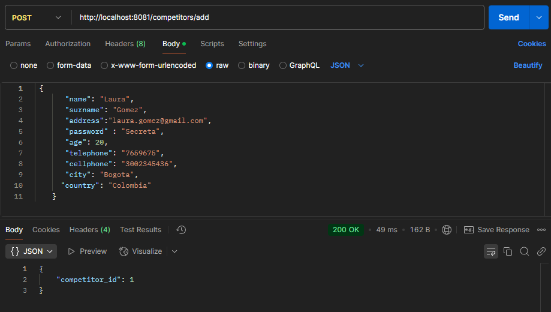
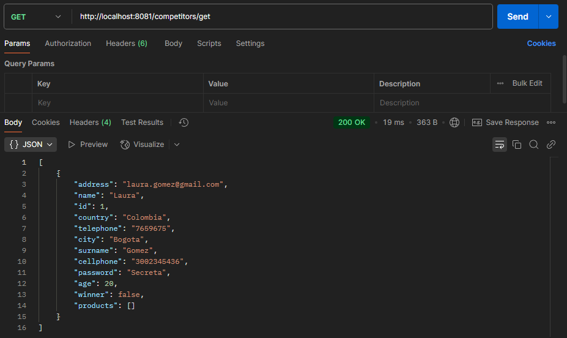
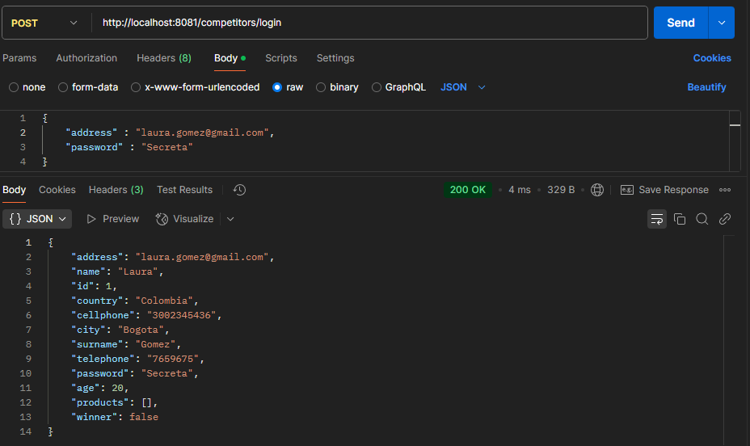
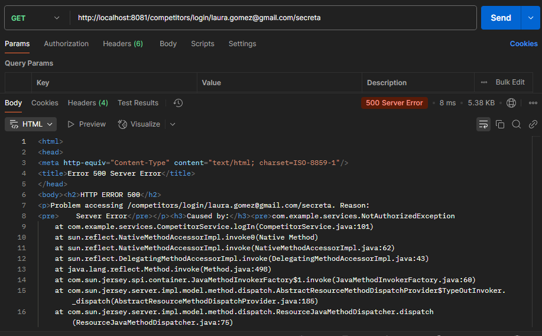
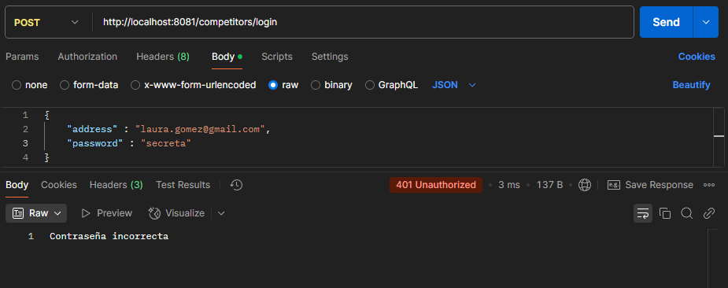

# JPA
Laboratorio de JPA

**Explique en un párrafo que efecto tiene haber agregado la aplicación @OneToMany en la entidad Competitor, sobre la tabla que se creó para la entidad Producto.**

La anotación agregada en la entidad Competitor indica que un competidor puede estar relacionado o asociado a muchos productos, lo cual se establece una relación uno a muchos con la entidad de Producto. La entidad de Producto tiene una columna adicional que es el que hace de llave foránea apuntando con el id del Competitor. Esto hace que cada producto esté vinculado a un solo competidor, y al mismo tiempo un competidor puede tener varios productos registrados.

